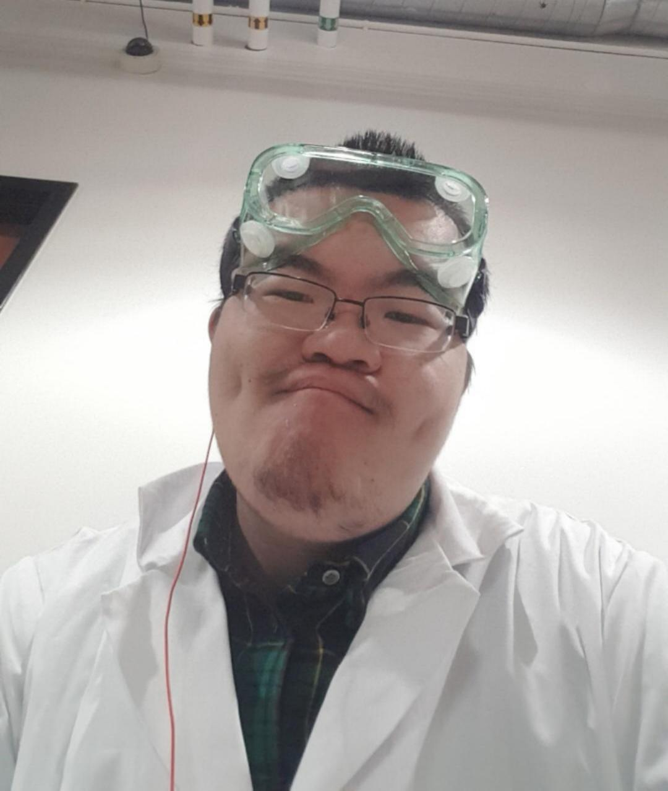

## Career
---

Social responsibility happens, 
Prove ones worth, increase disposable income.

* In fact, I have liked quiet thinking and research since I was very young. My parents always thought that I would develop in the direction of scientific research.
* I hope that my knowledge reserve is more technical. After having more than six years of relevant research field experience, I want to develop on a larger platform.
* I have always believed that artificial intelligence and interaction design are the singularities of the subsequent technological explosion.